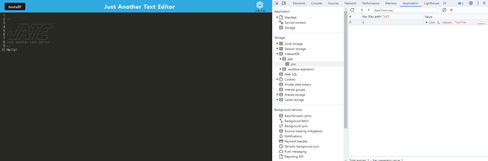

# PWA Text Editor (JATE)

## Description
A browser-based text editor that offers a seamless writing experience, even offline. This is a single-page application that meets the Progressive Web App (PWA) criteria, ensuring a reliable and performant user experience.

## User Story
```
AS A developer
I WANT to create notes or code snippets with or without an internet connection
SO THAT I can reliably retrieve them for later use
```

## Acceptance Criteria
```
GIVEN a text editor web application
WHEN I open my application in my editor
THEN I should see a client server folder structure
WHEN I run `npm run start` from the root directory
THEN I find that my application should start up the backend and serve the client
WHEN I run the text editor application from my terminal
THEN I find that my JavaScript files have been bundled using webpack
WHEN I run my webpack plugins
THEN I find that I have a generated HTML file, service worker, and a manifest file
WHEN I use next-gen JavaScript in my application
THEN I find that the text editor still functions in the browser without errors
WHEN I open the text editor
THEN I find that IndexedDB has immediately created a database storage
WHEN I enter content and subsequently click off of the DOM window
THEN I find that the content in the text editor has been saved with IndexedDB
WHEN I reopen the text editor after closing it
THEN I find that the content in the text editor has been retrieved from our IndexedDB
WHEN I click on the Install button
THEN I download my web application as an icon on my desktop
WHEN I load my web application
THEN I should have a registered service worker using workbox
WHEN I register a service worker
THEN I should have my static assets pre cached upon loading along with subsequent pages and static assets
WHEN I deploy to Heroku
THEN I should have proper build scripts for a webpack application
```

## Installation
1. Clone this repository to your local machine
2. Navigate to the repository's root directory
3. Install the required dependencies by running: `npm install`
4. Start the server: `npm start`

## Technologies Used
This text editor was built using the following technologies and tools:

- Node.js
- Express.js
- Babel
- IndexedDB
- Webpack + Workbox
- Concurrently
- Heroku for deployment

## Contribute
Feel free to contribute to this project by creating a pull request. I welcome any improvements or feature additions to make this text editor even better!

## Deployment
This text editor is deployed on Heroku. Check it out [here](https://enigmatic-beach-03832-82d6a6e7b9dd.herokuapp.com/).

## Screenshot
